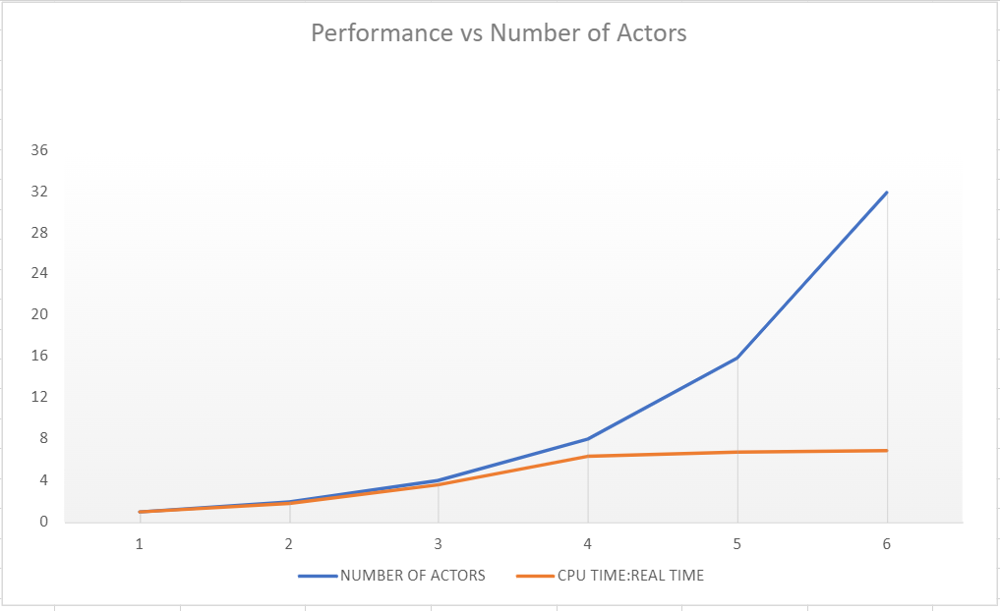

# DOSP Project 1: Bitcoin Mining - Erlang's Actor Model
****
## Group Details

<strong>Name: [ Pradyumna_Pasumarty : Sai Ram Varma_Budharaju ]</strong>

<strong>Members</strong>
<ol>
    <li>Sai Ram Varma Budharaju (UFID: 3337-4276 | <a>sbudharaju@ufl.edu</a>)</li>
    <li>Pradyumna Pasumarty (UFID: 6907-9707 | <a>ppasumarty@ufl.edu</a>)</li>
</ol>

****

## Application Description

The main purpose of this application is to mine bitcoins whose SHA 256 Hashes start with a certain number of leading zeroes. 
This number can be specified in the input to the application. 
The application was built in Erlang in a Distributed paradigm using Erlang's Actor Model. 
Furthermore, a 'Client Server' architecture was employed to simulate the realistic usage of this application.

****

## Design Details

<ul>
    <li>
        Client Server Architecture
        <ul>
            <li>Both the client & server are initialized as nodes on remote systems</li>
            <li>These remote nodes are connected through erlang's Network Administration capabilities</li>
            <li>Post successful connection,the client triggers the server to start mining</li>
            <li>The required number of leading zeroes are also provided in the request</li>
        </ul>
    </li>
     
    <li>
        Actor Model Implementation
        <ul>
            <li>The server spawns a Boss & Child Actors to address the required task</li>
            <li>The Child Actors communicate with the Boss Actor through messages whenever valid coins are mined</li>
            <li>This Distributed implementation results in significant performance boost over a synchronous implementation</li>
        </ul>
    </li>
     
    <li>
        Hash Generation and Checking
        <ul>
            <li>The input key is created by concatenating a random string prefixed with a group member ID</li>
            <li>The key is then Hashed to SHA 256 standard using Erlang's Crypto functions</li>
            <li>If the hash has the required number of leading zeroes, it is considered as a valid bitcoin</li>
            <li>Such valid bitcoins are duly outputted onto the console</li>
        </ul>
    </li>
     
    <li>
        Performance Monitoring
        <ul>
            <li>The Real times and CPU Times are captured per actor & then aggregated</li>
            <li>This approach is employed to gain a detailed inference</li>
            <li>Furthermore, these values are written to a text file for plotting</li>
        </ul>
    </li>
</ul>

****

## Setup and Execution

<ol>
    <li>
        Setup
        <ul>
            <li>Client: <code>erl -name myclient@10.xx.xxx.xx -setcookie bitcoinminer</code></li>
            <li>Server: <code>erl -name myserver@10.xx.xxx.xx -setcookie bitcoinminer</code></li>
        </ul>
        <i>10.xx.xxx.xx indicates the IPv4 address of the respective machines</i>
    </li>
     
    <li>
        Connection
        <ul>
            <li>Client: <code>net_adm:ping('myserver@10.xx.xxx.xx').</code></li>
            <li>Upon successful connection, server returns <strong>pong</strong> to the client</li>
        </ul>
    </li>
     
    <li>
        Execution
        <ul>
            <li>Client Compilation: <code>c(miningclient).</code></li>
            <li>Server Compilation: <code>c(miningserver).</code></li>
            <li>Server Start: <code>miningserver:start_link().</code></li>
            <li>Client Call: <code>miningserver:triggerMiningOnServer(<<i>Number of leading zeroes</i>>).</code></li>
        </ul>
    </li>
</ol>

****

## Testing Methodology

<ol>
    <li>The application was initially tested for mining 512 coins synchronously i.e. without any actors</li>
    <li>The performance was measured for this execution for 4 leading zeroes</li>
    <li>The actor model was then implemented and the application was re-tested with the same parameters</li>
    <li>A significant performance improvement is observed when the Actor Model is implemented</li>
</ol>
<strong>Machine Specifications</strong>
<table>
    <th>Type</th>
    <th>Operating System</th>
    <th>Cores</th>
    <tr>
        <td>Client</td>
        <td>MacOS</td>
        <td>8</td>
    </tr>
    <tr>
        <td>Server</td>
        <td>Windows</td>
        <td>8</td>
    </tr>
</table>
<i>Note: The target of 512 coins was chosen because it's a multiple of two. This allows us to test the application with number of actors as multiples of two i.e. 2,4,8,16 actors & so on. The target is always evenly split among the actors.</i>

****

## Testing Results

### Size of Work Unit for Best Performance = 8 Actors
This inference can be derived from the below table based on the CPU Time:Real Time Metric. It is seen that this ratio is significant at 8 actors and then stagnates afterwards. Since there is no major improvement over 8 actors with 16 and 32 actors, it is unnecessary to use more than 8 actors.

### Results of mining 512 coins (No. of Leading Zeroes = 4)

<table>
    <th>Number of Actors</th>
    <th>CPU Time (milliseconds)</th>    
    <th>Real Time (milliseconds)</th>
    <th>CPU Time : Real Time</th>
    <tr>
        <td>1 (Synchronous)</td>
        <td>230616</td>
        <td>218125</td>
        <td>1 : 1</td>
    </tr>
    <tr>
        <td>2</td>
        <td>201406</td>
        <td>110122</td>
        <td>1.8 : 1</td>
    </tr>
    <tr>
        <td>4</td>
        <td>256015</td>
        <td>70260</td>
        <td>3.6 : 1</td>
    </tr>
    <tr>
        <td>8</td>
        <td>400937</td>
        <td>62650</td>
        <td>6.4 : 1</td>
    </tr>
    <tr>
        <td>16</td>
        <td>349562</td>
        <td>50785</td>
        <td>6.8 : 1</td>
    </tr>
    <tr>
        <td>32</td>
        <td>397250</td>
        <td>57192</td>
        <td>6.9 : 1</td>
    </tr>
</table>

    

### Important Coin Details

<ul>
    Leading Zeroes: 8 (Maximum)
    <ul>
        <li>ppasumarty;q/FNgETM    00000000cdd88ee1821c4f97a51f82213b17c64e1962cea7562399439bba4204</li>
    </ul>
     
    Leading Zeroes: 7
    <ul>
        <li>ppasumarty;a0f1N2J/    0000000b86b5ef0ba85669db8b43233b01da398e4f51b787dc1833f7e2ecbd02</li>
        <li>ppasumarty;7zd2xiel    00000001e2841e0fe2814642192abe98bfa7fb8b24d76bc5db13be1aa38da48d</li>
    </ul>
</ul>
<i>
Note: The system is capable of mining coins with more leading zeroes, but since this doesn't 
execute in a realistic timeframe, the maximum is denoted as 8.</i>

### Largest number of working machines the code was run with: 2
Since the Client-Server architecture was developed in a one-to-one relationship, the maximum machines involved are 2.

